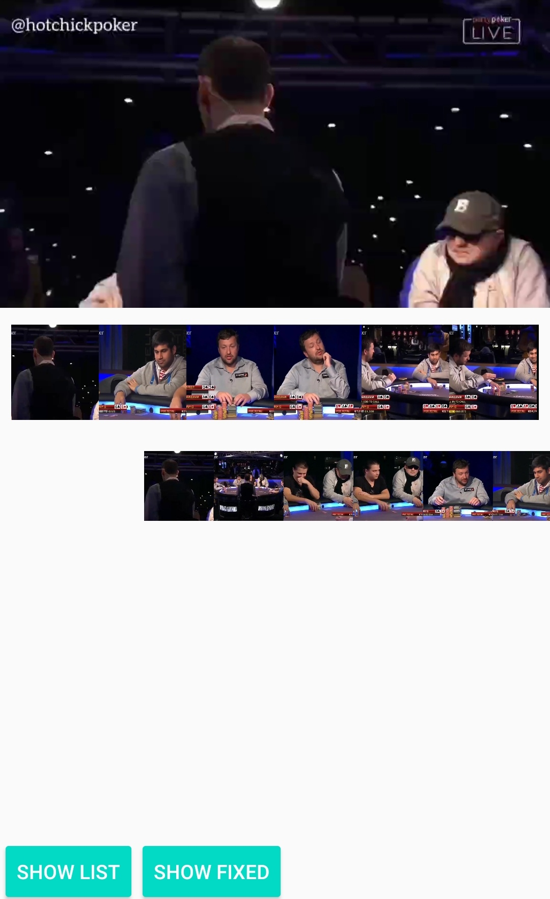

# ExoPlayerTimelineView

If you already use ExoPlayer in your project and need to extract video
frames and show them as a **timeline view** either scrollable or in a
fixed-width mode then you're in the right place.

<p align="center">

</p>

You might already be familiar with `MediaMetadataRetriever` api and its
`getFrameAtTime(..)` method, I included adapter implementation(it's not
meant for production use) for comparison with `RetroInstance` API, which
caches frames internally and won't init any mediaCodec resource if
unnecessary. And it's running significantly faster.

### Installation
Add this to your application module, inside *dependencies* block.
```sh
dependencies {
    implementation 'com.chemicalbird.android:videotimelineview:0.0.4'
}
```

### Usage example

1. For fixed frame list there is already an implementation of
   `GLSurfaceView` that you can use out of the box. Your layout and code
   goes like this.

```sh
<com.video.timeline.render.TimelineGlSurfaceView
        android:id="@+id/fixed_thumb_list"
        android:layout_width="match_parent"
        android:layout_height="68dp"
        />
```
```sh
VideoTimeLine.with(fileUri).show(glSurfaceView);
```

2. To create a frame grabber MediaRetriever implementation use
   `RetroInstance`, for example pass it to your RecyclerView.Adapter. To
   get a frame at specific time call 
   `retroInstance.load(presentationTime, callback)`. Checkout Sample 
   project for more details.

```sh
RetroInstance retroInstance = new RetroInstance.Builder(context, mediaUri).setFrameSizeDp(180).create();
    
// in adapter
retroInstance.load(position * frameDuration, holder.hashCode(),
                file -> imageLoader.load(file, imageView));
```


